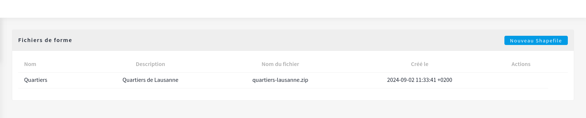
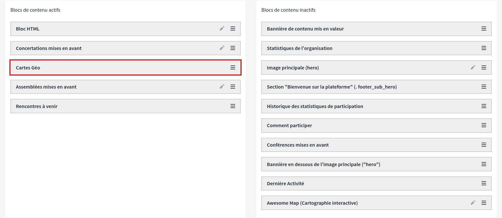
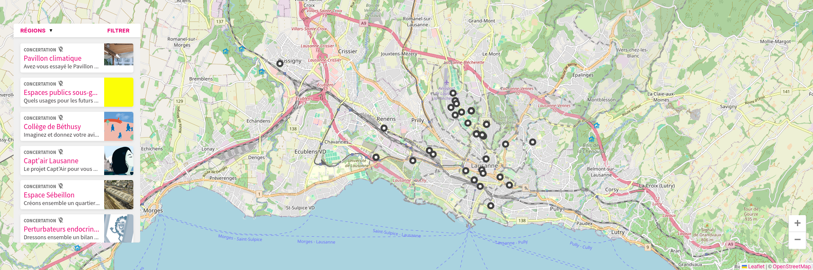

We just released the first stable version of Decidim Geo.
Check out the features we've got!

<!-- truncate -->

**Link shapes to a scope** 
On the admin side, you can now upload a zip shapefile in the `WGS 84` format.
Once uploaded, you can assign a scope type to the shapefile.

Example of use: 
- Add a shapefile to the admin with the shapes of the city neighborhoods
- Create a scope type called "neighborhoods"
- For each neighborhood, create a scope of type "neighborhoods"
- Link related meetings, assemblies, processes, and proposals to these scopes
- See the magic: the maps now display the neighborhoods, allowing you to navigate the platform through maps. 

---

**Homepage block** 
In the homepage settings, you can now drag a Decidim Geo block to display a map
with all the points of the platform.
> Once the Decidim Geo homepage block is active, the map will provide an entry point to
> navigate through the participatory platform.
> 

---

**Replace Decidim Default Map** 
All maps in Decidim are now Decidim Geo maps. From any proposals, meetings, or processes, users will be able to 
discover new pages of the platform.
