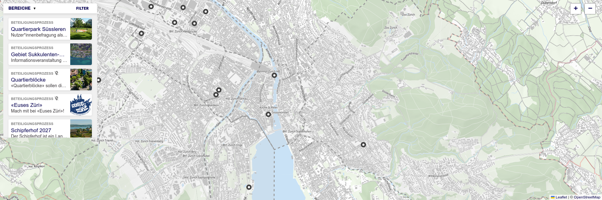

Define general settings for Decidim Geo, like zoom level and the default map center. 
Check out the features we've got!

<!-- truncate -->

**Default map center and zoom** 
You can now customize all Decidim Geo maps at once by defining a default center and zoom level. 
This provides a better experience when loading the map, already having the right perspective to start navigating.

To update the map's center and zoom, go to the Geo tab in the administration and click on Configuration.

---

**Custom Tiles** 
You can now define custom tiles to change the underlying appearance of the map.
Displaying custom tiles allows more precise control over what is viewed, and can, for example, increase map contrast for better accessibility.

---

**Hide maps when there is nothing to show** 
Maps will be hidden if there is no point to show. For example, a meeting without a location won't display a map in its details. 
Scopes that do not contain any data will also be hidden, preventing the user from filtering something when there is no data to display.
