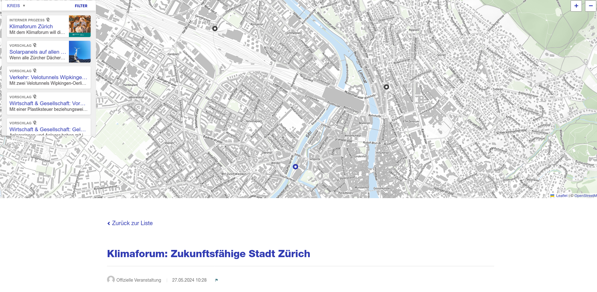

We're working on making the navigation experience smoother. 
Check out the features we've got!

<!-- truncate -->

**Highlight points** 
We've defined some rules to highlight points displayed on the current page:

- When you are on a meeting detail page that is geolocated, the current point will be highlighted.
- When you are on a meeting page, all geolocated points will be highlighted.

Same for proposals, debates etc.

---

**Discover points around** 
If you have multiple processes linked to the same geolocated scope, points will appear to suggest navigating through the area you are currently in. 

Imagine the following situation:
- A participatory budget is running in the neighborhood.
- In the same neighborhood, another process is gathering projects.

From the participatory budget page, you will see all the points in the neighborhood, providing a quick overview of what is happening there.

---

**Go Back Action** 
If you click on a point, the view will zoom in and center on the clicked point. Once you click back, it will return to the exact same state you were in before clicking — the same zoom level and position. This enhancement encourages users to quickly explore what is present on the map.
