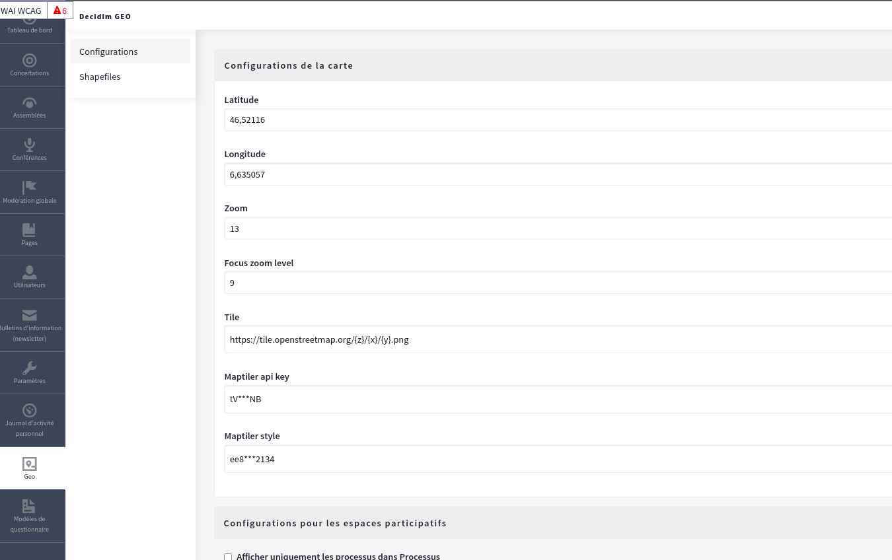
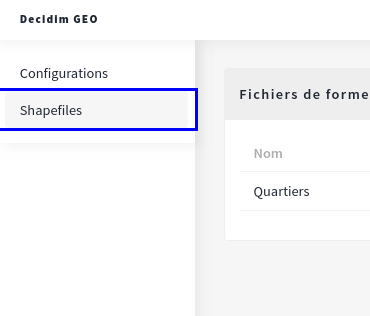
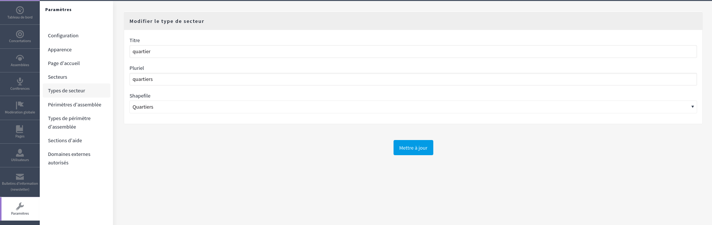
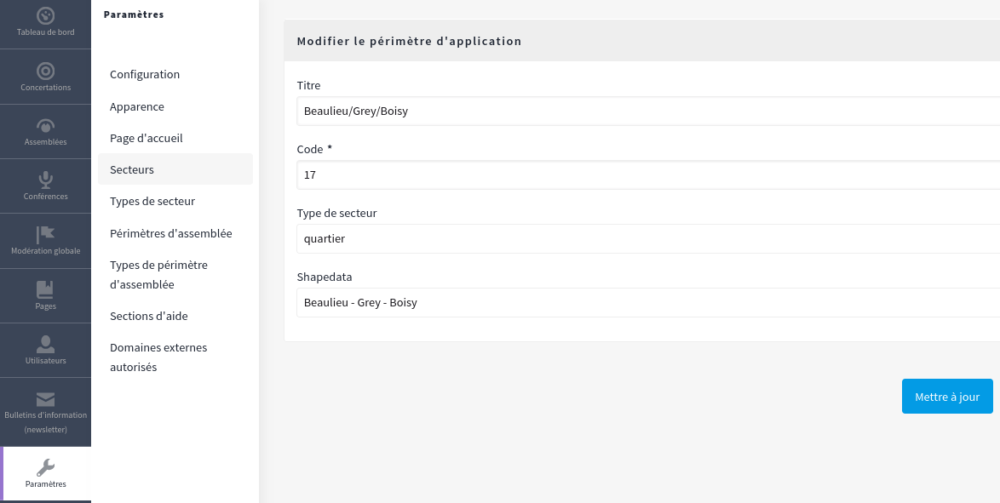

# Scope with a Geographical Area

Decidim Geo allows you to upload a shapefile, a file containing multiple shapes. After uploading, you can assign each shape to a Decidim scope, creating a transversal navigation across your platform.

:::info
Configuring shapefiles and assigning shapes to scopes are optional.
If you haven’t used Decidim Scopes before, you can safely skip this page.
:::

## Prerequisites
Your shapefile must meet the following requirements:

- Shapes must contain a `NAME` metadata field. This name will be the label used on your admin side.
- The shapefile must be a zip file containing only shape data files. No additional files (e.g., .DS_Store or other system-specific files) are supported.
- Shapes must be exported in the WSG-84 projection.

## Upload the Zip File
To upload the zip file, go to your administration dashboard and click on the "Geo" icon.

In the lateral menu, click on the Shapefile tab and upload your zip file. The upload may take a moment as all shapes are saved to the database, so please be patient.

## Link Shapefile to a Scope Type
Once uploaded, you can link a shapefile to a scope type. Once linked, all scopes of that scope type will be geo-compatible.

## Link Scopes to Shape Data
After specifying a geo-friendly scope type, all associated scopes will include a field named "Shape Data." This allows you to select the corresponding shape data for each scope.

