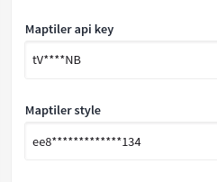

# Customize Map tiles
:::info
A tiled web map, slippy map or tile map, is a map displayed in a web browser by semlessly joining
dozens of individually requestd image or vector data files. It is the most popular way to display and navigate maps.
:::

Decidim Geo supports png tiles, and MapTiler vector data files. This enables you to change the aspect of the map, to use a country-specific style, or a specific view (like plans/satellites).
Tiles are a very important options, and should be picked up with some considerations: 

- **Who is distributing the map**: If the tiles come from google maps, you need to know that Google will be able to trace your user activity
- **What are the use constraint**: In some cases (like openstreet map), you will have a limit in number of download per day. You need to know what is this limit
- **What is the tile project**: We will use exclusivly WSG-84 map projection, be sure the tiles you will use are in this same projection. 

**Services distributing tiles** 
You will find here some services that distributes tiles in png: 

- Here Platform
- CartoCDN
- Open Street Map

## Using a vector tiles
For now, we support only the vector tiles from MapTiler. 
To use map tiler, you can create a new custom map in MapTiler, and once saved, use it's API Key and Style id to save the map styler integration. 

:::info
We might change the internal library (leaflet) to have a native support on vector tiles (Map Liber). 
But this is unplanned for now. 
:::