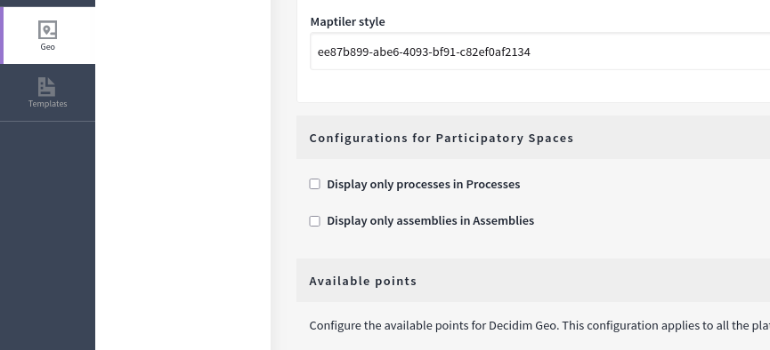
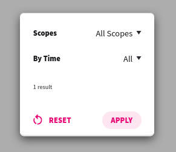

# Customize Space Pages (Assemblies, Processes)

To provide a focused view when accessing the main pages for assemblies or processes, you can configure Decidim Geo to display only specific types of spaces on the map.

- **Display only assemblies on the Assemblies page:** On the main assemblies page, Decidim Geo will show only assemblies.
- **Display only processes on the Processes page:** On the main processes page, Decidim Geo will show only processes.

To set this option, go to the Decidim Geo configuration page in the admin dashboard.

**When Active, the _Type_ Filter Won't Appear in Decidim Geo**  
If this option is enabled, the type filter will be hidden, as these maps will display only the selected assembly or process type.

