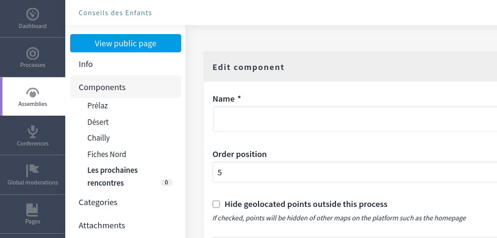

# Hide Points from Map

**Use Case**  
When using proposals to gather data from citizens, you may have points not directly related to participation. In these cases, you may want to restrict the visibility of these points to their specific space. For example, if there are proposals within "Data Gathering Ideas," these proposals will only appear within the context of this Assembly and will not be visible in other areas, such as the homepage.

## Configuration

In the component configuration of geo-friendly components, you can hide geolocated points from appearing outside their designated space (assembly or process).

