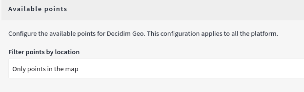

# Work Only with Points on the Map

By default, Decidim Geo includes all points, even those that are not geolocated. This feature allows participants to explore broader participation, such as processes that affect all spaces.

In some cases, you may want Decidim Geo to strictly use only points with specific locations on the map. Fortunately, there is an option for this in the administration panel.

