:::info
You can skip this section if you already have your shapefile ready. 
:::

# Before Starting
Decidim Geo adds GIS functionality to Decidim and works with a specific geo-data file type called a Shapefile. A shapefile describes polygons, including their shape, name, and other metadata.

Decidim Geo allows you to bind shapefiles to Decidim scopes, enabling use cases such as:

- Adding a shape per neighborhood
- Adding regions (south/east/west) to the platform
- Using Decidim for a country or state with geographic shapes

## Prepare Your Shapes in QGIS
[QGIS](https://qgis.org/) is an open-source desktop application commonly used for geographic data manipulation. It enables various operations like creating layers, polygons, or points. In Decidim Geo, we use QGIS to prepare polygonal shapes for assignment to Decidim scopes.

**Install QGIS**  
[Install QGIS for your operating system (Mac/Linux/Windows): https://qgis.org/download/](https://qgis.org/download/)

**Open QGIS and use the OpenStreetMap tiles**  

**Add a Shapefile Layer**  
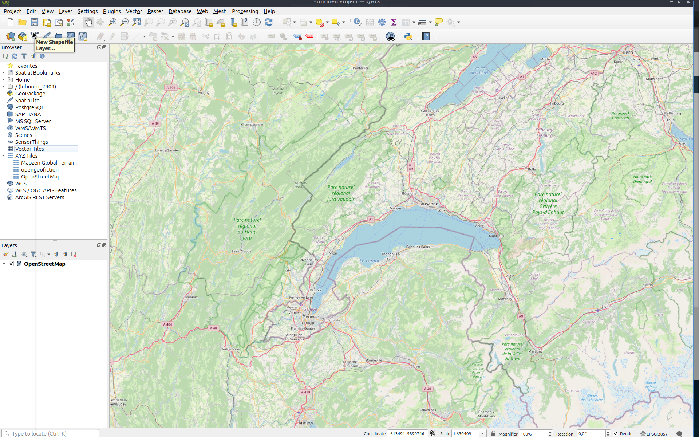

**Add Details to the New Layer**  
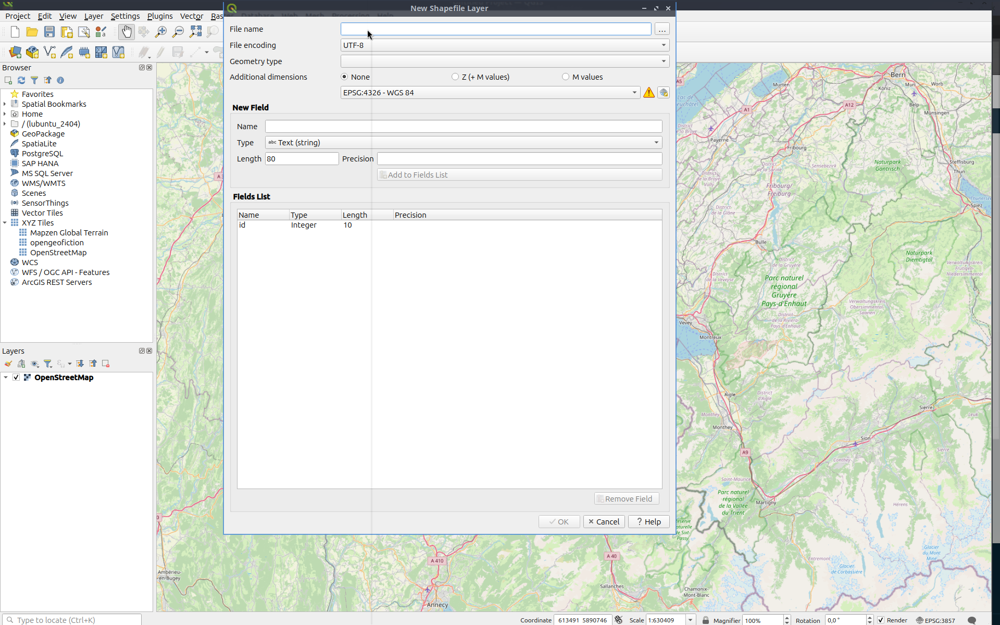

- **File Name:** The name of the layer you will work on
- **File Encoding:** UTF-8
- **Additional Dimension:** None, in WGS-84

**Add a `NAME` Field**  
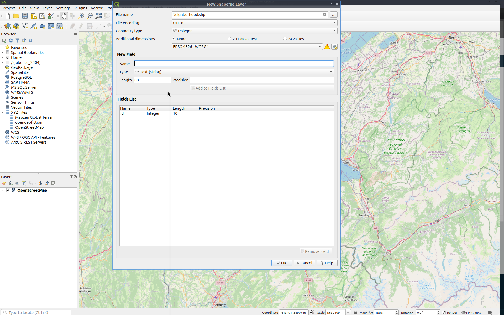

- **Name:** NAME
- **Type:** Text
- **Length:** Set the maximum length for your shape label (200 is usually sufficient)

**Add Field to List**  
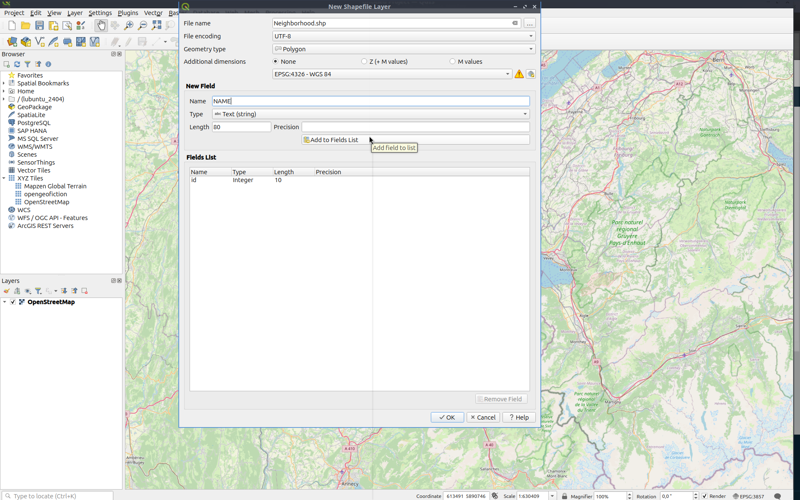

**Select Your New Empty Layer**  
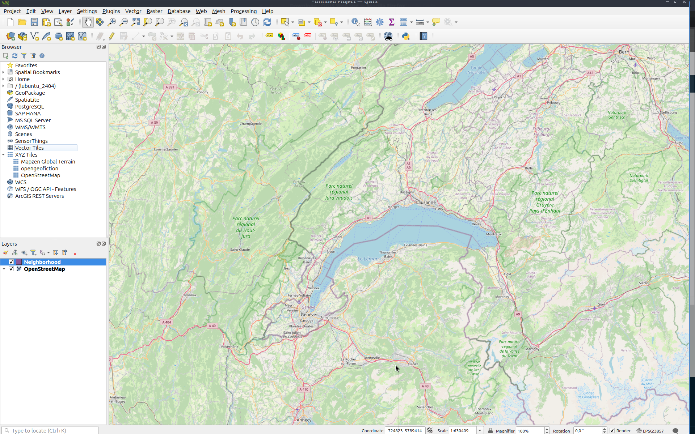

**Click the Edit (Pencil) Button**  
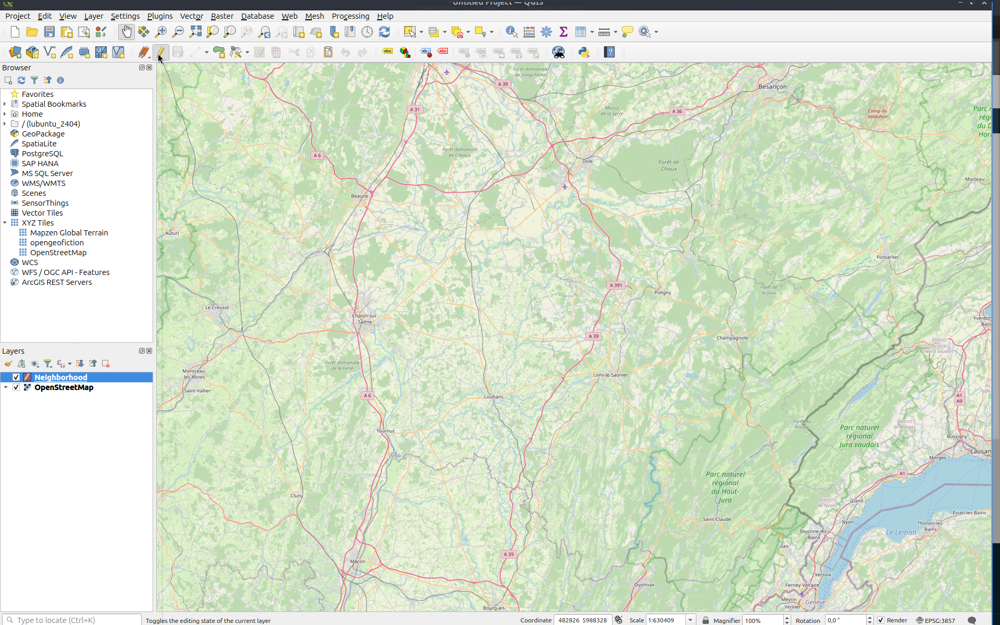  
Click the pencil button on the top bar to start editing your shape.

**Select Polygon Tool**  
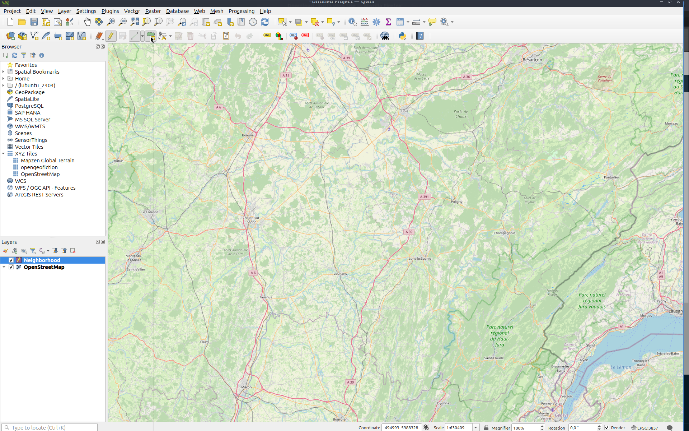

**Draw Your Shape**  
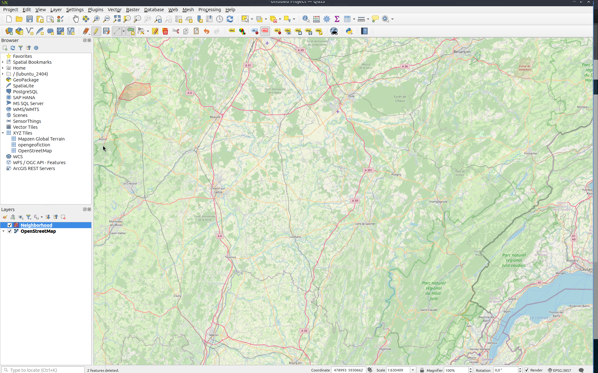  
Click to define each point of your polygon. When complete, right-click to finalize the shape.

**Complete the ID and NAME Fields**  
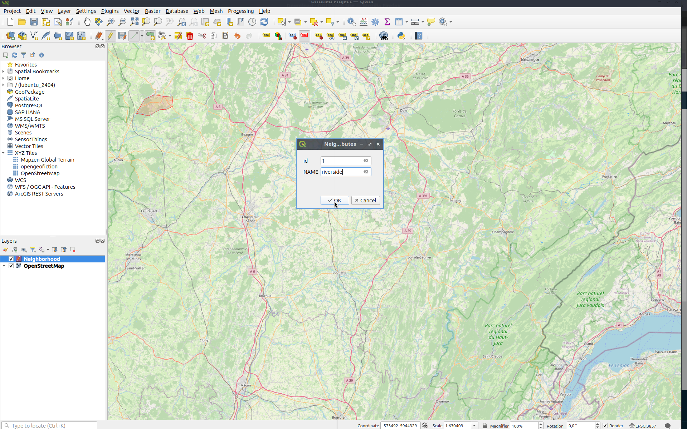

- **ID:** Any unique numeric value
- **NAME:** The label for the shape in Decidim (used by admins only)

**Add More Shapes if Needed**  
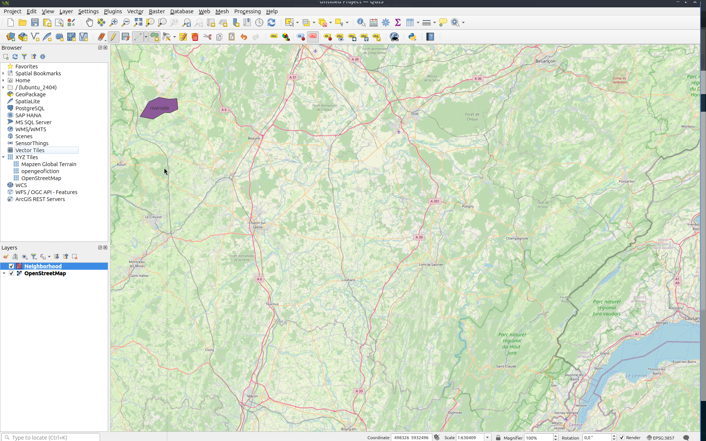

**Export the Shape**  
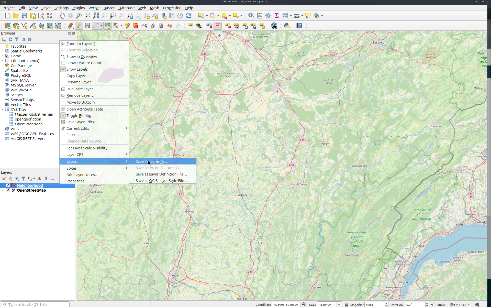

- Right-click on the shape layer
- Select Export > Save Feature As

**Export Settings**  
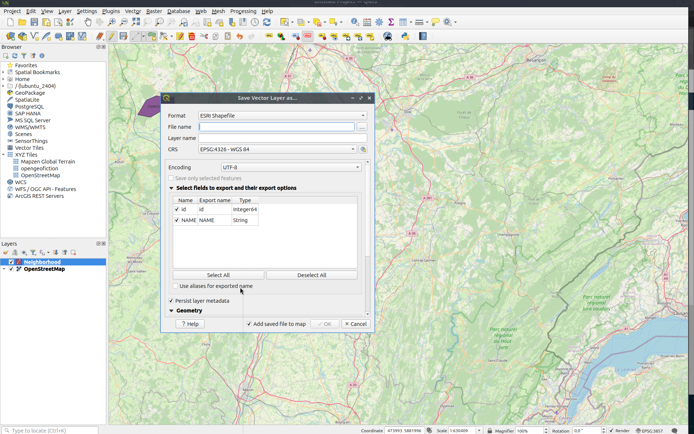

- **Filename:** Avoid special characters, spaces, or uppercase letters
- **Layer Name:** Same as filename
- **CRS:** WSG 84

Click **OK** to export.

**Find the Exported Files on Your Computer**  

- Select all six generated files
- Compress these files into a zip file

-> Done! You now have a zip file that can be uploaded through the Decidim administration.
