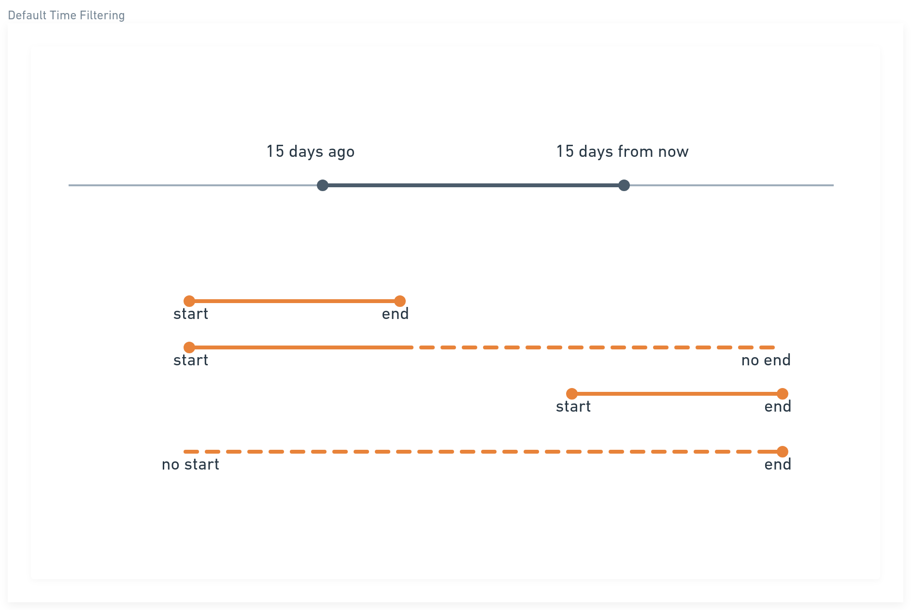
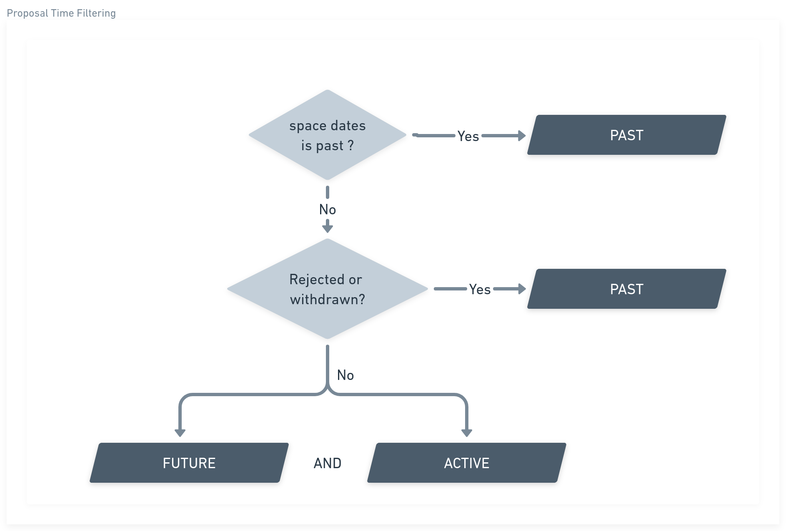

# Time filter
Decidim Geo allows filter by past, active and future time. Each resources react diferently to this filter. 

## Default time filtering

The following resources use the default time filtering: 

- Assembly
- Process
- Accountability Result
- Proposal
- Meeting

We extract the start and end date for this resources, and apply the following logics:

## Accountability time filtering
To keep accountabilities on the map, they react a bit differently than other resources. 
Accountabilities that belongs to a past process/assembly will stay active as long as it has no end_date. 
This means accountabilities that are still in implementation, even they started in the past, can be displayed in Decidim Geo Map. 

## Proposal time filtering
Proposals does not have a start or end date, we choose then to classifies the proposal in the 
less frictional way. 

- We look up the space of the proposal (assembly, proposal)
- If the space is in the past, then put it on the past filter.
- If the proposal is in rejected or withdrawn status, we put as well in the past
- Else, the proposal will appear in both filter: active and future.

